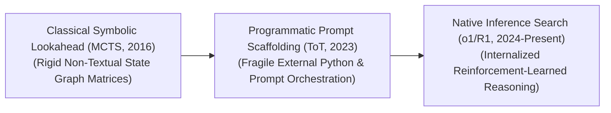
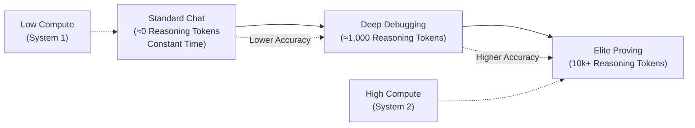

# Awesome-Test-Time-Computation
## Test-Time Computation: Evolution, Variants, Types, & Applications

Test-Time Computation—also referred to as inference-time compute scaling, System 2 execution, or lookahead search—is an advanced architectural and prompt-engineering paradigm that scales a model’s cognitive reasoning capacity during the inference phase. Traditionally, deep learning models operate under a rigid **Constant-Time Inference Wall**: for any given input, a model executes a fixed number of floating-point operations (FLOPs) determined strictly by its parameter count, spending identical compute tokens to answer a trivial question versus a complex, multi-hop logical proof. 

Test-Time Computation breaks this restriction, shifting AI from rapid, intuitive next-token predictions (System 1) to deliberate, multi-path, and self-correcting algorithmic processing (System 2). By allowing models to allocate additional processing tokens at runtime to explore alternative hypotheses, query programmatic verifiers, and backtrack from errors, inference compute scaling unlocks a massive, predictable surge in reasoning capabilities, mimicking the human habit of "thinking longer before answering."

---

## 1. The Macro Chronological Evolution

The implementation of inference-time scaling has transitioned from classical game-tree lookaheads to external programmatic prompt abstractions and native, reinforcement-learned cognitive search loops.

| Era / Phase | Description & Limitations / Significance | Year First Used | First Paper Link |
| :--- | :--- | :--- | :--- |
| [The Classical Symbolic Lookahead Era (AlphaZero MCTS, ~2016–2022)](details/classical_symbolic_lookahead.md) | *Concept:* The foundational engineering baseline. Combined deep neural value networks with classical graph-theory traversal via **Monte Carlo Tree Search (MCTS)**. The network evaluated static game-board configurations, and the search graph simulated millions of future trajectory possibilities before selecting the optimal path [INDEX: 18].  *Limitation:* Bounded entirely to strict, non-textual mathematical game rules and closed environments, making it structurally incompatible with open-ended natural language reasoning. | 2017 | [Silver et al., 2017](https://arxiv.org/abs/1712.01815) |
| [The External Prompt Scaffolding Era (~2023–2024)](details/external_prompt_scaffolding.md) | *Concept:* Brought structured search to textual language tokens. Frameworks like **Tree-of-Thoughts (ToT)** and **Graph-of-Thoughts (GoT)** wrapped standard LLMs inside external programmatic scaffolds (Python runtime environments) [INDEX: 1]. The scaffolding directed the model to generate multiple alternative reasoning steps as individual text nodes, using separate prompt passes to score and prune paths via classical search algorithms.  *Limitation:* Heavy API latency overhead and exceptional fragility; minor variations in the text outputs frequently broke the regex string parsers, stalling execution graphs [INDEX: 1]. | 2023 | [Yao et al., 2023](https://arxiv.org/abs/2305.10601) |
| [The Native Reinforcement-Learned Search Era (~2024–Present)](details/native_reinforcement_learned_search.md) | *Concept:* The current modern state-of-the-art foundation standard. Pioneered by architectures like OpenAI’s **o1/o3** series and DeepSeek's **DeepSeek-R1** [INDEX: 18, 21]. It internalizes the tree-search and verification properties directly within the model's parameters via large-scale **Reinforcement Learning (RL)**.  *Significance:* The model generates a verbose, hidden "thinking trace" composed of special structural tokens before outputting its final response [INDEX: 1]. It naturally learns to execute self-correction, test alternative mathematical identities, and backtrack from false assumptions natively inside the generation stream [INDEX: 1]. | 2024 | [DeepSeek-AI, 2025](https://arxiv.org/abs/2501.12948) |

---

## 2. Core Functional & Algorithmic Search Variants

Test-Time Computation methodologies are strictly categorized based on whether they scale compute via parallel continuous sampling, explicit tree searches, or token-level verifications.

| Variant | Mechanism & Details | Year First Used | First Paper Link |
| :--- | :--- | :--- | :--- |
| [A. Parallel Sampling & Majority Voting (Best-of-N / Self-Consistency)](details/parallel_sampling_majority_voting.md) | **Mechanism:** The simplest, most parallelizable form of inference compute scaling. The system samples N independent, parallel responses from a model at a high decoding temperature simultaneously. It then applies an automated verifier or a token-level **Majority Vote (Self-Consistency)** to extract the most mathematically frequent or statistically coherent final answer.  **Pros:** Requires zero changes to the underlying model code and maps out flat horizontal scaling loops easily over large server clusters. | 2022 | [Wang et al., 2022](https://arxiv.org/abs/2203.11171) |
| [B. Tree-Search & Backtracking Scaling (MCTS / DFS ToT)](details/tree_search_backtracking_scaling.md) | **Mechanism:** Structures text generation as a dynamic search tree [INDEX: 1]. At each logic milestone, a policy head generates a cluster of alternative candidate paths [INDEX: 1]. A process-supervised value model scores the viability of each branch [INDEX: 1]. If a branch score hits a dead end, a **Depth-First Search (DFS) or MCTS algorithm** forces the inference decoder to backtrack to a previous valid state tensor to explore an alternative route [INDEX: 1]. | 2023 | [Yao et al., 2023](https://arxiv.org/abs/2305.10601) |
| [C. Programmatic Verifier-in-the-Loop Computing (RLVR Integration)](details/programmatic_verifier_in_the_loop.md) | **Mechanism:** Connects the generative token path to hard, non-neural software environments [INDEX: 17]. As the model steps through its calculations, it writes executable Python scripts or formal math proofs, passing them straight to sandboxed compilers or interactive theorem provers (ITPs) [INDEX: 17, 21]. The code execution error or compiler stack trace is fed back into the context window instantly, forcing the model to allocate test-time compute tokens specifically to fix compile errors [INDEX: 17, 21]. | 2021 | [Cobbe et al., 2021](https://arxiv.org/abs/2110.14168) |

---

## 3. Structural Scaling Profiles & Computation Horizons

Depending on the targeted difficulty of the problem, test-time compute scales across distinct execution parameters.

| Scaling Profile | Mechanism & Significance | Year First Used | First Paper Link |
| :--- | :--- | :--- | :--- |
| [The Compute Allocation Scaling Law (Thinking Token Budgets)](details/compute_allocation_scaling_law.md) | *Profile:* Much like pre-training compute scaling laws (Chinchilla parameters), test-time compute follows a highly predictable performance curve: downstream task accuracy scales as a clean power-law function of the absolute **number of thinking tokens generated at inference time**.  *Significance:* To solve a highly difficult Math Olympiad problem, engineers scale up the token generation cap budget (e.g., allowing the model to write 10,000+ tokens of hidden thoughts), expanding model capability without touching base weights. | 2024 | [Snell et al., 2024](https://arxiv.org/abs/2408.03314) |
| [Test-Time Speculative Verification](details/test_time_speculative_verification.md) | *Profile:* Optimizes token serving overhead. A lightweight, hyper-fast draft model generates rapid candidate thinking traces, while a massive target model evaluates the entire block of speculative thought tokens in a single parallelized matrix pass, protecting user-facing latency. | 2022 | [Leviathan et al., 2023](https://arxiv.org/abs/2211.17192) |

 Test-Time Compute Budget

---

## 4. Production Engineering Challenges & Hardware Solutions

Deploying variable-length test-time compute loops across commercial cloud serving nodes completely disrupts traditional fixed-latency infrastructure scaling.

| Production Challenge | Description & Mitigation | Year First Used | First Paper Link |
| :--- | :--- | :--- | :--- |
| [The Key-Value (KV) Cache Satiation and VRAM Footprint Crisis](details/kv_cache_satiation_vram_crisis.md) | *The Problem:* Because models must write thousands of verbose, intermediate thinking tokens before delivering a final response, the active Key-Value attention cache inflates aggressively. This consumes immense amounts of GPU VRAM per user session, triggering cluster-wide Out-of-Memory system crashes and capping serving concurrency.  *Mitigation:* Implementing **Multi-Head Latent Attention (MLA)** to compress cached attention matrices down into a low-rank latent vector, coupled with **PagedAttention virtual memory mapping** to optimize tensor slot allocations non-contiguously. | 2023 | [Kwon et al., 2023](https://arxiv.org/abs/2309.06180) |
| [The Time-to-First-Token (TTFT) and User Latency Gap](details/time_to_first_token_latency_gap.md) | *The Problem:* In consumer-facing production streams (like chat assistants), users expect response loops to initiate within milliseconds. A test-time search model that spends 30 seconds calculating alternative hypotheses behind a hidden thinking layer creates a highly latent user experience.  *Mitigation:* Implementing **Streaming Thoughts UI Scaffolding** (rendering a live, interactive summary accordion of the model's real-time hidden thinking tokens to keep the user engaged), combined with **Chunked Prefill kernels** to streamline execution. | 2023 | [Agrawal et al., 2023](https://arxiv.org/abs/2308.16369) |

---

## 5. Frontier Real-World AI Infrastructure Applications

| Infrastructure Application | Description & Details | Year First Used | First Paper Link |
| :--- | :--- | :--- | :--- |
| [Automated Competitive Mathematics Proving & Science Discoveries](details/automated_competitive_mathematics.md) | *Application:* Solves extreme combinatorial reasoning puzzles, International Math Olympiads (IMO), and chemistry simulation derivations. By scaling up test-time search compute over Lean 4 or SymPy verifiers, models autonomously test identities, cross-reference data boundaries, and evaluate millions of symbolic paths to generate provably correct scientific proofs [INDEX: 1, 17, 21]. | 2024 | [Trinh et al., 2024](https://www.nature.com/articles/s41586-023-06747-5) |
| [Long-Horizon Software Engineering & Repository Maintenance](details/long_horizon_software_engineering.md) | *Application:* Powers autonomous software development networks (such as Devin or SWE-bench agent architectures) [INDEX: 1]. The test-time compute layer forces the model to treat coding tickets as a closed-loop search problem: reading file trees, generating patch code scripts, analyzing compiler errors inside local sandboxes, and backtracking to refactor scripts recursively until all validation tests pass [INDEX: 1]. | 2023 | [Jimenez et al., 2023](https://arxiv.org/abs/2310.06770) |
| [Mission-Critical Legal & Financial Forensic Audits](details/mission_critical_legal_financial_audits.md) | *Application:* Reviews multi-departmental corporate profiles and intricate litigation records [INDEX: 1]. Inference-time search scaling allows the agent to construct detailed multi-hop verification paths, dynamically evaluating compliance variances across decades of conflicting regulatory text files before finalizing its executive report [INDEX: 1]. | 2023 | [Guha et al., 2023](https://arxiv.org/abs/2308.11462) |

---

## References
1. Silver, D., et al. (2017). Mastering chess and shogi by self-play with a general reinforcement learning algorithm. *arXiv preprint arXiv:1712.01815* [INDEX: 18].
2. Wang, X., et al. (2022). Self-consistency improves chain of thought reasoning in language models. *arXiv preprint arXiv:2203.11171*.
3. Yao, S., et al. (2023). Tree of thoughts: Deliberate problem solving with large language models. *arXiv preprint arXiv:2305.10601* [INDEX: 1].
4. Cobbe, K., et al. (2021). Training verifiers to solve math word problems. *arXiv preprint arXiv:2110.14168* [INDEX: 21].
5. Snell, C., et al. (2024). Scaling LLM test-time compute optimally can be more effective than scaling model parameters. *arXiv preprint arXiv:2408.03314*.
6. DeepSeek-AI. (2025). DeepSeek-R1: Incentivizing reasoning capability in LLMs via large-scale reinforcement learned test-time compute loops. *GitHub Repository Technical Report* [INDEX: 18, 21].

---

To advance this documentation repository, infrastructure workspace, or post-training pipeline, consider exploring these adjacent development pathways:
* Build a **Python script utilizing a sandboxed compilation API** to illustrate how to capture compiler error codes and route them directly back into an LLM's active test-time self-correction context loop [INDEX: 17, 21].
* Generate a **comprehensive Markdown table** explicitly comparing Constant-Time Inference, Parallel Best-of-N Voting, External Scaffolding Search (ToT), and Native Reinforcement-Learned Search (o1/R1) across computational inference latencies, VRAM cache inflation footprints, requirements for specialized value models, and error backtracking flexibility [INDEX: 1, 18, 21].
* Establish a **performance evaluation harness using Triton** to profile exactly how compiling a low-rank latent attention mechanism (MLA) alters the wall-clock throughput and token generation efficiency of a model scaling past 5,000 hidden thinking tokens [INDEX: 18].

