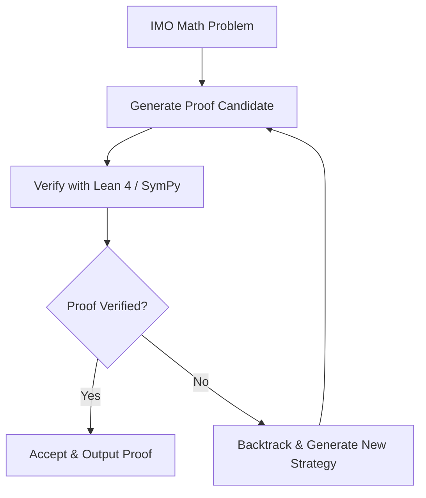

# Automated Competitive Mathematics Proving

AI systems leverage test-time compute scaling to solve extreme combinatorial puzzles and compete in International Mathematics Olympiads (IMO).

## How It Works
Models generate candidate mathematical proofs (e.g., using Lean 4) and verify them using computer-checked proof checkers. The search loops allow the model to try millions of symbolic paths until a valid proof is verified.

## Success Cases
- AlphaGeometry
- AlphaProof
- OpenAI o1 scoring gold-medal standard on IMO datasets

[← Back to README](../README.md)
