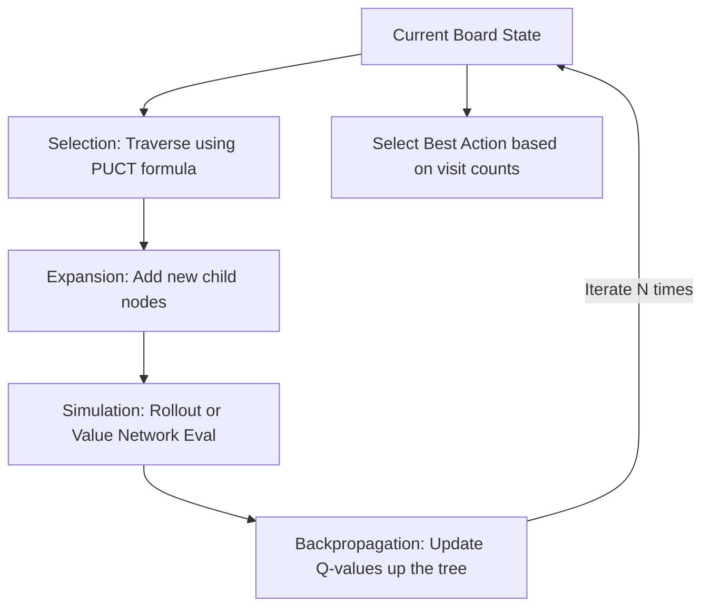

# Classical Symbolic Lookahead (AlphaZero MCTS)

Classical Symbolic Lookahead represents the foundational baseline of search and planning in AI, famously utilized in systems like AlphaGo and AlphaZero. This paradigm combines deep neural network evaluations with classical graph-theory traversal using Monte Carlo Tree Search (MCTS).

## How It Works
Instead of relying solely on immediate policy outputs, MCTS builds a search tree by simulating potential future steps. The policy network guides the search direction, while the value network evaluates leaf nodes to assess the probability of winning from that state.

## Limitations
- **State Space:** Bounded to closed environments with structured mathematical rules (e.g., chess, Go).
- **Text Incompatibility:** Incompatible with open-ended natural language reasoning where the transition dynamics and state space are infinite and poorly defined.

[← Back to README](../README.md)
