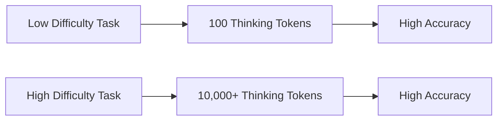

# The Compute Allocation Scaling Law

The Compute Allocation Scaling Law (or Thinking Token Budgets) describes how test-time compute scales accuracy predictably during inference.

## How It Works
Similar to pre-training scaling laws, downstream reasoning accuracy scales as a power-law function of the absolute number of thinking tokens generated at inference time. By increasing the thinking token budget, performance on difficult tasks improves.

## Significance
Allows models to solve highly complex problems (such as Math Olympiad questions) without modifying the base weights, simply by adjusting the inference runtime compute budget.

[← Back to README](../README.md)
