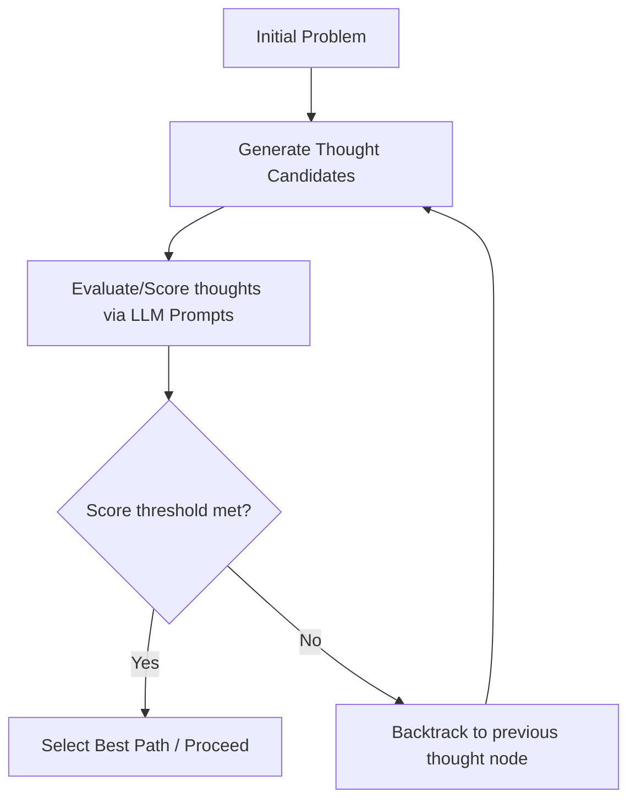

# External Prompt Scaffolding (ToT & GoT)

External prompt scaffolding transitioned structured lookahead search into the domain of textual language tokens by wrapping Large Language Models in external runtime orchestrators.

## How It Works
Frameworks like Tree-of-Thoughts (ToT) and Graph-of-Thoughts (GoT) manage LLM generation via an external program (e.g., Python). The system prompts the LLM to generate multiple alternate steps (thoughts), evaluates each candidate using heuristic prompt templates, and executes classical search algorithms like DFS, BFS, or shortest path traversal over the generated state graph.

## Limitations
- **High Latency:** Requires multiple sequential API calls for generation and evaluation.
- **Fragility:** Extremely fragile as minor changes in formatting can break parsing scripts, causing the execution graph to fail.

[← Back to README](../README.md)
