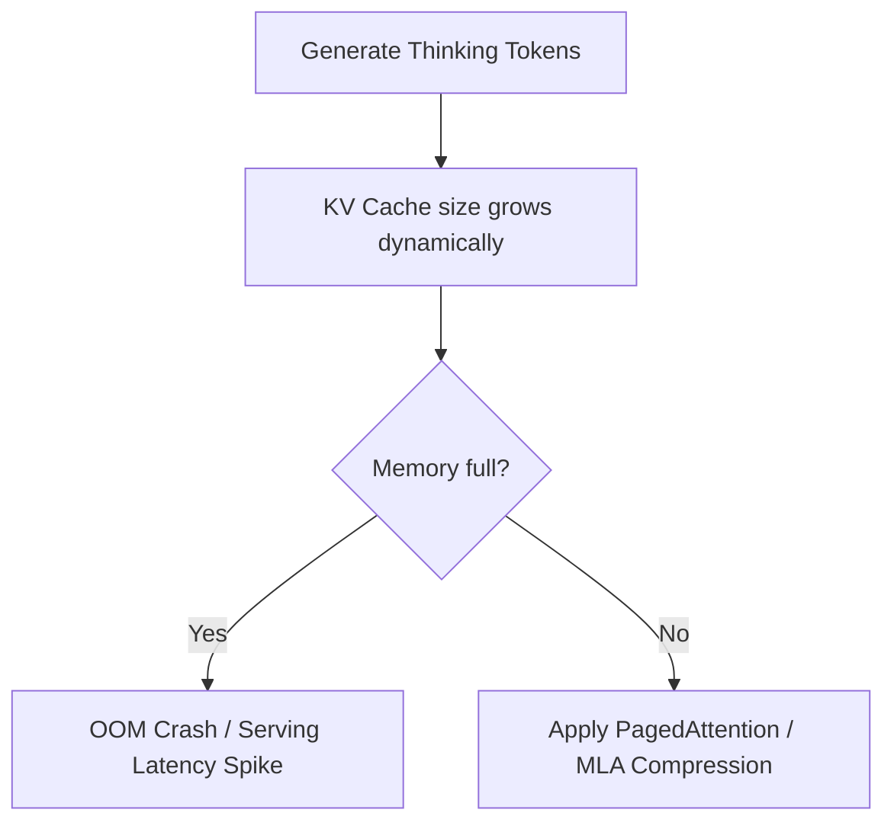

# KV Cache Satiation & VRAM Footprint Crisis

Variable-length test-time compute loops create significant challenges for serving infrastructure due to Key-Value (KV) cache inflation.

## How It Works
As a model generates thousands of thinking tokens, the attention key-value vectors must be kept in VRAM to compute attention for subsequent tokens. This causes the cache to grow aggressively, leading to Out-of-Memory (OOM) errors.

## Mitigations
- **PagedAttention:** Virtual memory mapping for KV caching.
- **Multi-Head Latent Attention (MLA):** Low-rank compression of attention keys and values.

[← Back to README](../README.md)
