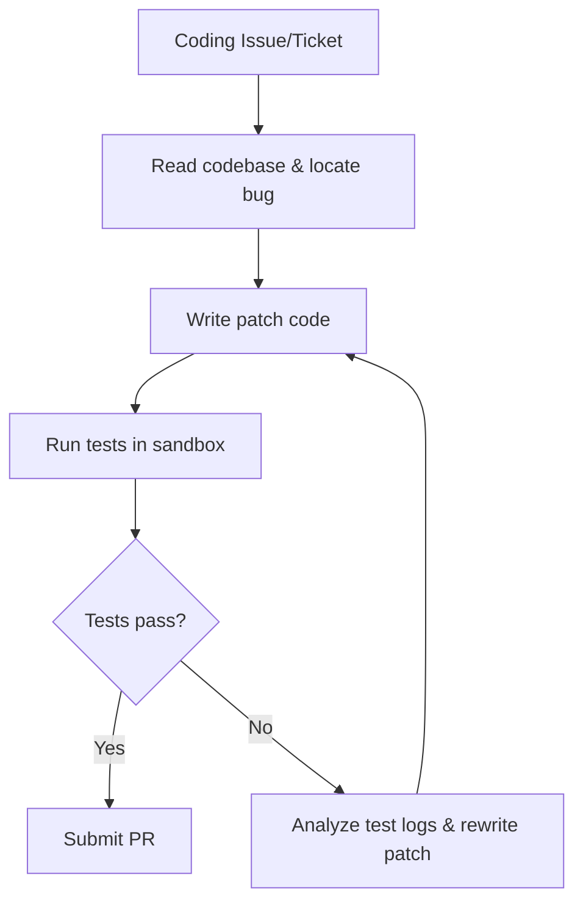

# Long-Horizon Software Engineering & Repository Maintenance

Software engineering requires reasoning over multi-file repositories, making it a prime application for test-time scaling.

## How It Works
Models explore repository file trees, generate candidate patches, and run them inside local test environments. The error traces from failing unit tests guide the backtracking and refinement of the patch code.

## Frameworks
- SWE-bench agent architectures
- Devin and similar autonomous coding agents

[← Back to README](../README.md)
