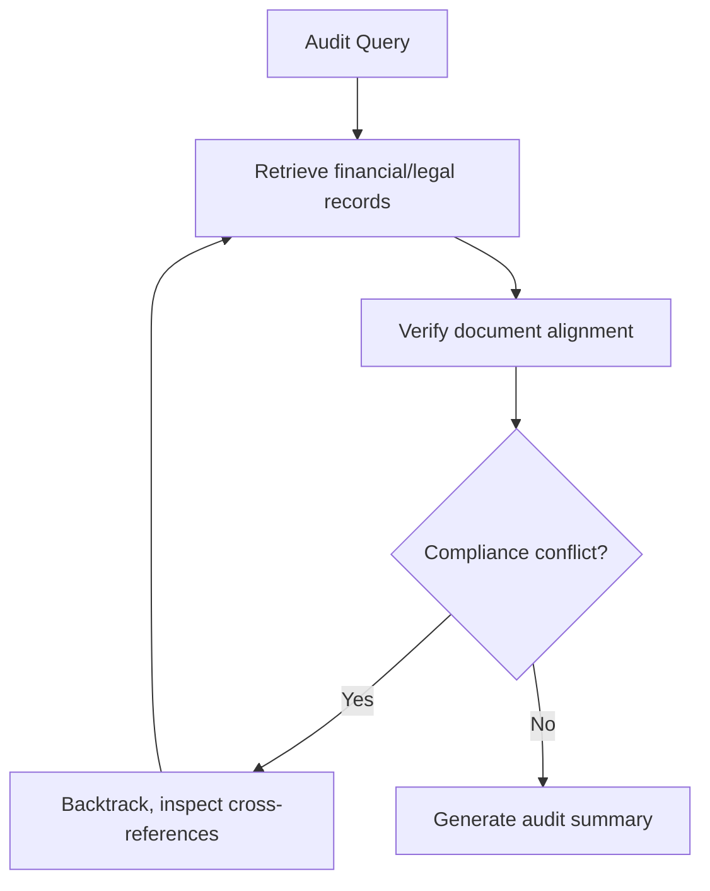

# Mission-Critical Legal & Financial Forensic Audits

In high-stakes domains like finance and law, errors are costly, requiring comprehensive lookahead reasoning.

## How It Works
AI agents build multi-hop reasoning verification paths, retrieving and cross-referencing information from thousands of legal and financial documents, verifying compliance issues, and backtracking if conflicting data is found.

## Impact
Improves compliance accuracy and lowers hallucination rates when processing long-context financial reports and legal contracts.

[← Back to README](../README.md)
