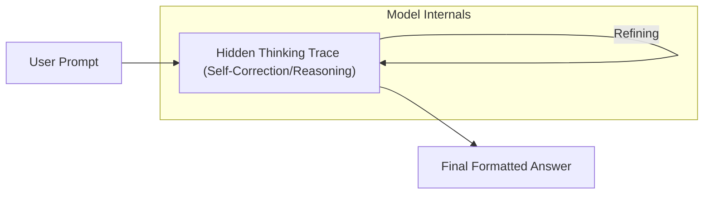

# Native Reinforcement-Learned Search (o1 & R1)

Native Reinforcement-Learned Search represents the modern state-of-the-art approach to inference-time compute scaling. Rather than relying on external scripts, the reasoning and search behavior are learned natively by the model.

## How It Works
Through large-scale Reinforcement Learning (RL), models (such as OpenAI's o1/o3 and DeepSeek-R1) learn to generate a hidden "thinking trace" before producing the final user-facing response. The model learns to break down problems, perform internal verification, self-correct mistakes, and backtrack from incorrect assumptions.

## Significance
By internalizing the search loops directly within the parameters, the model is highly robust, avoids brittle string parsers, and scales performance naturally as a function of the token budget.

[← Back to README](../README.md)
