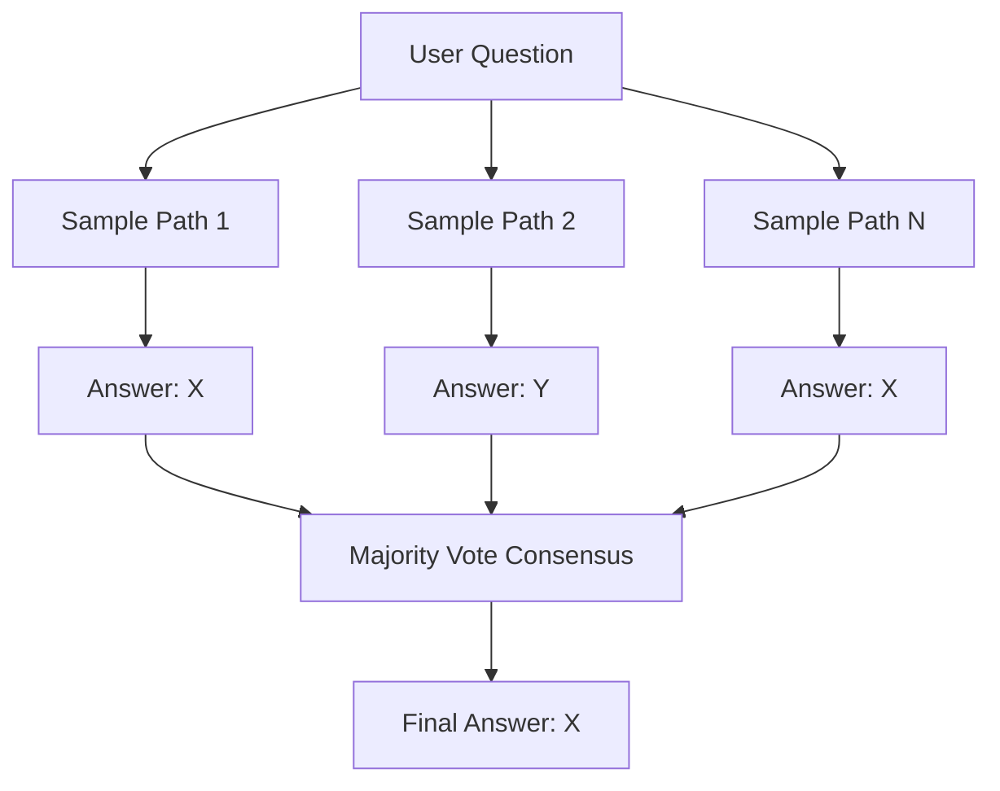

# Parallel Sampling & Majority Voting

Parallel Sampling & Majority Voting (often called Best-of-N or Self-Consistency) scales inference compute by leveraging parallel continuous sampling.

## How It Works
Instead of generating a single path, the system samples $N$ independent, parallel reasoning paths from the model at a higher decoding temperature. An automated verifier or token-level majority vote is then applied to extract the most common or coherent final answer.

## Pros & Cons
- **Pros:** Highly parallelizable, simple to implement, and requires no modification to the underlying model.
- **Cons:** Computationally expensive, scaling linearly with the number of samples.

[← Back to README](../README.md)
