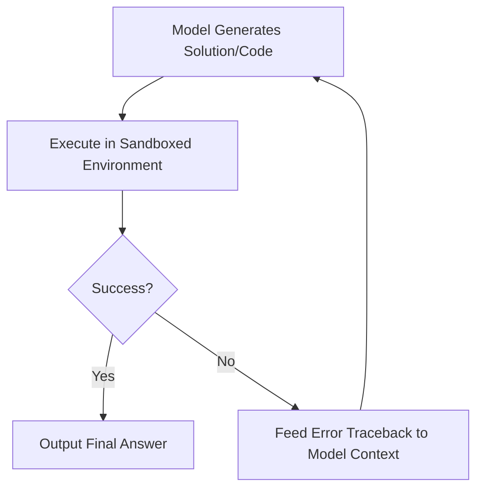

# Programmatic Verifier-in-the-Loop Computing

Programmatic Verifier-in-the-Loop Computing combines generative language models with exact software execution environments to achieve high-fidelity reasoning.

## How It Works
The model generates code or formal proofs and executes them in real time within a sandboxed environment (e.g., Python interpreter, Lean 4 prover). If execution fails, the traceback error is fed directly back into the context window, allowing the model to correct its mistakes.

## Applications
- Interactive Theorem Proving (Lean 4)
- Safe code execution (Python, Bash)
- Mathematical derivation validation

[← Back to README](../README.md)
