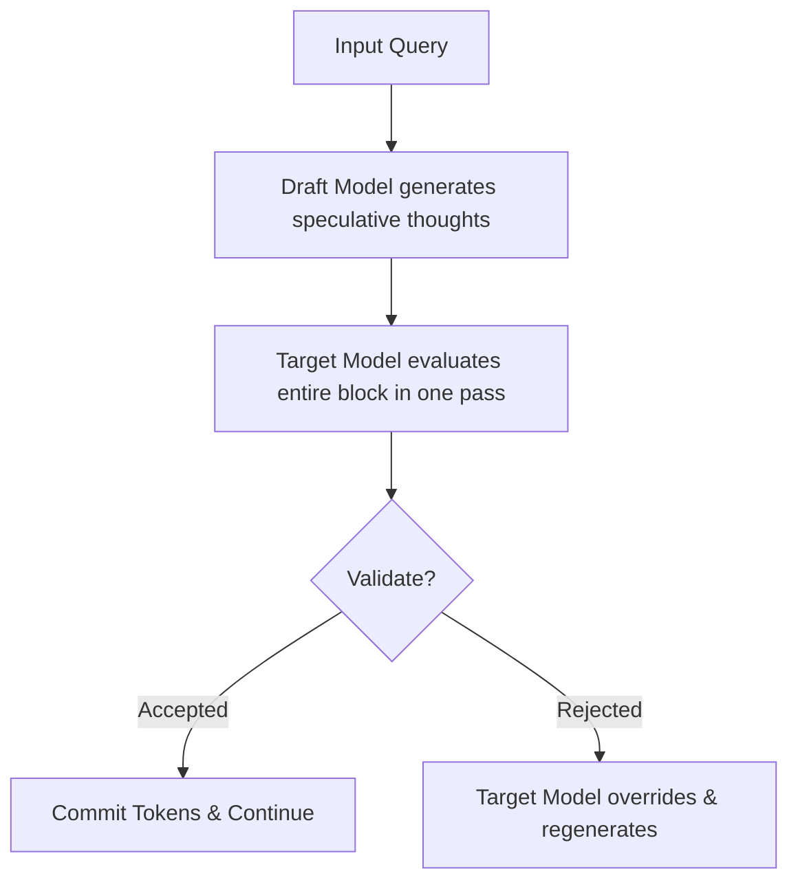

# Test-Time Speculative Verification

Test-Time Speculative Verification optimizes the computational overhead associated with running massive reasoning models.

## How It Works
A lightweight, fast draft model generates candidate thinking traces, and a larger, highly accurate target model evaluates and verifies the entire block of tokens in a single parallelized forward pass.

## Benefits
Significantly reduces serving latency and VRAM usage without sacrificing the quality of the final output.

[← Back to README](../README.md)
