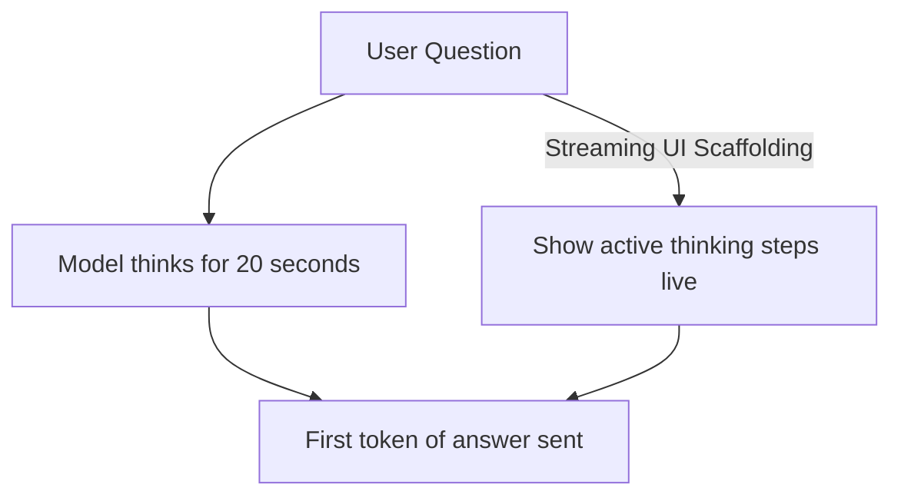

# Time-to-First-Token (TTFT) & User Latency Gap

User-facing production systems require rapid initial responses, but deep reasoning models take time to compute thoughts, creating a latency gap.

## How It Works
Because the model must generate thinking traces (which can take 10-30 seconds) before outputting the first answer token, users experience a large delay (TTFT).

## Mitigations
- **Streaming Thoughts UI:** Showing real-time reasoning progress inside interactive UI components.
- **Chunked Prefill:** Interleaving prefill tasks with decoding tasks to maintain responsive streams.

[← Back to README](../README.md)
