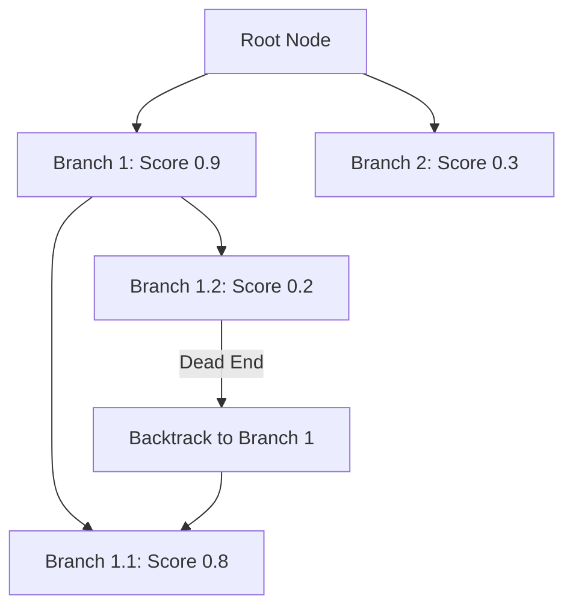

# Tree-Search & Backtracking Scaling

Tree-Search and Backtracking Scaling models text generation explicitly as a tree-traversal problem during decoding.

## How It Works
At each step, a generator model proposes multiple token pathways. A process-supervised value model (PRM) scores the viability of each branch. If a branch score drops below a threshold, the decoder backtracks to a previous checkpoint and explores an alternate branch.

## Key Algorithms
- Depth-First Search (DFS)
- Monte Carlo Tree Search (MCTS)
- A* Search

[← Back to README](../README.md)
